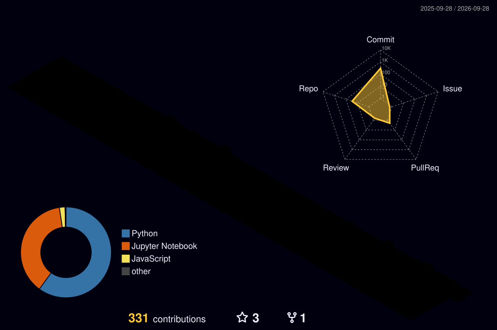

<!-- =====================================================================
  PORTFOLIO README: Omrawat11
  Theme: Tokyo Night (Dark-First Aesthetic with Light Mode Support)
  Author: Om Rawat (@Omrawat11)
  Institution: LNCT Bhopal (RGPV) • B.Tech AI & ML (4th Semester)
  Location: Bhopal, Madhya Pradesh, India

  TABLE OF CONTENTS:
  01. Animated Header Banner
  02. Dynamic Typing SVG Subtitle
  03. Profile Counter & Badges Row
  04. About Me
  05. Tech Stack (Categorized with Skillicons)
  06. 3D Contribution Calendar Graph (yoshi389111)
  07. Contribution Snake Animation (Platane/snk)
  08. GitHub Analytics & Streak Stats
  09. GitHub Achievements & Trophies
  10. Featured Priority Projects (2-Column Responsive Grid)
  11. Open Source Contributions & Community Journey
  12. Learning Roadmap & Skill Progress
  13. Recent Activity & Developer Motivation
  14. Connect With Me (Socials & Contact)
  15. Capsule Footer Wave & Navigation
===================================================================== -->

<div align="center">

  <!-- 01. ANIMATED HEADER BANNER (capsule-render) -->
  <a href="https://github.com/Omrawat11">
    
  </a>

  <!-- 02. TYPING ANIMATION (readme-typing-svg) -->
  <a href="https://github.com/Omrawat11">
    
  </a>

  <br />

  <!-- 03. PROFILE VIEWS & BADGE ROW (shields.io "for-the-badge") -->
  <p align="center">
    <a href="https://github.com/Omrawat11">
      
    </a>
    <a href="https://github.com/Omrawat11?tab=followers">
      
    </a>
    <a href="https://github.com/Omrawat11?tab=stars">
      
    </a>
    <a href="https://www.linkedin.com/in/om-rawat-530499399/" target="_blank" rel="noopener noreferrer">
      
    </a>
    <a href="https://www.kaggle.com/omrawat22" target="_blank" rel="noopener noreferrer">
      
    </a>
    <a href="https://maps.google.com/?q=Bhopal,+Madhya+Pradesh,+India" target="_blank" rel="noopener noreferrer">
      
    </a>
  </p>

</div>

---

<!-- 04. ABOUT ME -->
## 👨‍💻 About Me

Hello and welcome to my digital workshop! 👋 I am **Om Rawat**, a 4th-semester undergraduate pursuing **B.Tech in Artificial Intelligence & Machine Learning** at **LNCT Bhopal** (affiliated with RGPV) in Bhopal, India. 

I bridge mathematical intuition with practical software engineering—translating raw datasets into predictive models and real-time intelligent interfaces. Whether it's training supervised learning classifiers, fine-tuning neural architectures, or designing biometric pipelines, I focus on clean architecture, reproducible experiments, and performant code.

```yaml
identity:
  name: "Om Rawat"
  current_role: "B.Tech Student (4th Semester, AI & ML)"
  institution: "LNCT Bhopal (RGPV)"
  location: "Bhopal, Madhya Pradesh, India"
  passions: ["Predictive Modeling", "Deep Learning", "Generative AI", "Open-Source Development"]

status:
  current_focus: "🎯 Benchmarking ML Classification Models & Building AI Navigator"
  availability: "Open to Collaborative Research, Hackathons & AI/ML Internships"
```

- 🔭 **Currently working on:** **[Shoppers Intention AI](https://github.com/Omrawat11/Shopper_purchase_prediction)** (e-commerce purchase prediction) and **AI Navigator** (a comparative hub to evaluate and benchmark open-source AI models).
- 🌱 **Currently expanding knowledge in:** Deep Neural Architectures (CNNs, RNNs, LSTMs, Transformers) in **[Neural-Forge](https://github.com/Omrawat11/Neural-Forge)** and MLOps tooling.
- 👯 **Looking to collaborate on:** Open-source Machine Learning libraries, intelligent Python automations, and NLP/CV real-world solutions.
- 💬 **Ask me about:** Python, Scikit-learn, Data Preprocessing (NumPy/Pandas), OpenCV pipelines, and Exploratory Data Analysis.
- ⚡ **Fun fact:** I debug ML models with the same mindset I play chess—anticipating 5 steps ahead (and occasionally losing a rook to an unexpected shape mismatch!).

---

<!-- 05. TECH STACK -->
## 🛠️ Tech Stack & Tooling

<div align="center">

### 💻 Programming Languages
<p align="center">
  <a href="https://skillicons.dev">
    
  </a>
</p>

### 🧠 Machine Learning, Deep Learning & Data Science
<p align="center">
  <a href="https://skillicons.dev">
    
  </a>
</p>

### ⚙️ Developer Tools, Platforms & DevOps
<p align="center">
  <a href="https://skillicons.dev">
    
  </a>
</p>

</div>

<details>
<summary><b>📊 Detailed Breakdown of Libraries & Technical Competencies (Click to expand)</b></summary>
<br />

| Domain | Core Frameworks & Technologies | Practical Experience In Repositories |
| :--- | :--- | :--- |
| **Languages** | Python 3.x, C++, C, JavaScript (ES6+), HTML5, CSS3, SQL | Core scripting, DSA, Full-stack microservices |
| **Machine Learning** | Scikit-Learn, NumPy, Pandas, SciPy, Statsmodels | Hyperparameter tuning, Cross-validation, Feature Engineering |
| **Deep Learning & CV** | TensorFlow, PyTorch, OpenCV, InsightFace (SCRFD+ArcFace) | ANN, CNN, RNN implementations, Biometric verification |
| **NLP & RecSys** | CountVectorizer, TF-IDF, Cosine Similarity, OMDb API | Content-based recommendations (*CineSense AI*) |
| **Web & APIs** | FastAPI, Streamlit, RESTful Architecture, SerpAPI | Real-time prediction endpoints & interactive AI dashboards |
| **Developer Tools** | Git, GitHub Actions, VS Code, Linux / Bash, Postman | Automated CI/CD workflows, version control, API testing |

</details>

---

<!-- 06. 3D CONTRIBUTION GRAPH -->
## 🧊 3D Contribution Calendar

<div align="center">

  <p><i>An isometric 3D projection of commit frequency and code velocity, refreshed daily via GitHub Actions:</i></p>

  <picture>
    <source media="(prefers-color-scheme: dark)" srcset="./profile-3d-contrib/profile-night-rainbow.svg">
    <source media="(prefers-color-scheme: light)" srcset="./profile-3d-contrib/profile-green-animate.svg">
    
  </picture>

  <sub>⚡ Powered by <a href="https://github.com/yoshi389111/github-profile-3d-contrib">yoshi389111/github-profile-3d-contrib</a> • Automated via <a href="./.github/workflows/profile-3d.yml"><code>.github/workflows/profile-3d.yml</code></a></sub>

</div>

---

<!-- 07. CONTRIBUTION SNAKE ANIMATION -->
## 🐍 Contribution Snake Animation

<div align="center">

  <picture>
    <source media="(prefers-color-scheme: dark)" srcset="https://raw.githubusercontent.com/Omrawat11/Omrawat11/output/github-contribution-grid-snake-dark.svg">
    <source media="(prefers-color-scheme: light)" srcset="https://raw.githubusercontent.com/Omrawat11/Omrawat11/output/github-contribution-grid-snake.svg">
    
  </picture>

  <sub>✨ Animated autonomously on the <code>output</code> branch via <a href="./.github/workflows/snake.yml"><code>.github/workflows/snake.yml</code></a></sub>

</div>

---

<!-- 08. GITHUB STATS & STREAK ANALYTICS -->
## 📈 GitHub Analytics & Activity Metrics

<div align="center">

  <table border="0" cellpadding="0" cellspacing="0">
    <tr valign="top">
      <td width="50%" align="center">
        <a href="https://github.com/Omrawat11">
          
        </a>
      </td>
      <td width="50%" align="center">
        <a href="https://github.com/Omrawat11">
          
        </a>
      </td>
    </tr>
  </table>

  <br />

  <a href="https://github.com/Omrawat11">
    
  </a>

</div>

<details>
<summary><b>📊 View Dynamic Activity Graph & Historical Commits (Click to expand)</b></summary>
<br />
<div align="center">
  <p><i>Visualizing weekly commit volume across all repositories:</i></p>
  <a href="https://github.com/Omrawat11">
    
  </a>
</div>
</details>

<!--
<details>
<summary><b>⏱️ Optional WakaTime Coding Hours (Click to expand)</b></summary>
<br />
<div align="center">
  
</div>
</details>
-->

---

<!-- 09. TROPHIES -->
## 🏆 GitHub Trophies

<details open>
<summary><b>🏅 Earned Community & Repository Trophies (Click to toggle)</b></summary>
<br />
<div align="center">
  <a href="https://github.com/Omrawat11">
    
  </a>
</div>
</details>

---

<!-- 10. FEATURED PROJECTS -->
## 🚀 Featured Projects

A curated selection of real-world machine learning solutions, predictive models, and autonomous architectures built from scratch:

<div align="center">

<table border="0" cellpadding="8" cellspacing="0" width="100%">
  <!-- ROW 1 -->
  <tr valign="top">
    <!-- PROJECT 1: Shopper Purchase Prediction (Priority Entry) -->
    <td width="50%">
      <div align="center">
        <a href="https://github.com/Omrawat11/Shopper_purchase_prediction">
          
        </a>
      </div>
      <p><b>🛍️ Shopper Purchase Prediction (Shoppers Intention AI)</b></p>
      <p>Predicts online user purchase intent from e-commerce browsing behavior (bounce rate, exit rate, page values). Benchmarks Logistic Regression, KNN, Decision Tree, and Random Forest models.</p>
      <p>
        
        
        
        
      </p>
      <p>
        <a href="https://github.com/Omrawat11/Shopper_purchase_prediction"><b>Explore Code »</b></a>
      </p>
    </td>

    <!-- PROJECT 2: AI Navigator (Priority Entry) -->
    <td width="50%">
      <div align="center">
        <!-- AI Navigator Pin / Interactive Badge Card -->
        <a href="https://github.com/Omrawat11?tab=repositories&q=navigator">
          
        </a>
      </div>
      <p><b>🧭 AI Navigator</b> <i>(Model Discovery & Comparison Tool)</i></p>
      <p>An intelligent tool engineered to discover, evaluate, and benchmark foundation AI and ML models across performance scores, context lengths, and production use cases.</p>
      <p>
        
        
        
        
      </p>
      <p>
        <!-- TODO: update AI Navigator repo link once published/renamed -->
        <a href="https://github.com/Omrawat11?tab=repositories"><b>View Project Repository »</b></a>
      </p>
    </td>
  </tr>

  <!-- ROW 2 -->
  <tr valign="top">
    <!-- PROJECT 3: FaceTrace -->
    <td width="50%">
      <div align="center">
        <a href="https://github.com/Omrawat11/FaceTrace">
          
        </a>
      </div>
      <p><b>🔍 FaceTrace — Biometric Provenance Engine</b></p>
      <p>Reverse-image search pipeline matching faces via InsightFace (SCRFD+ArcFace), uncovering public web matches via SerpAPI, and establishing tamper-evident verification trails.</p>
      <p>
        
        
        
      </p>
      <p>
        <a href="https://github.com/Omrawat11/FaceTrace"><b>Explore Code »</b></a>
      </p>
    </td>

    <!-- PROJECT 4: MindPulse AI (Mental Health Prediction) -->
    <td width="50%">
      <div align="center">
        <a href="https://github.com/Omrawat11/Mental_Health_Prediction">
          
        </a>
      </div>
      <p><b>🧠 MindPulse AI — Student Wellbeing Prediction</b></p>
      <p>Predicts student mental wellbeing indices based on sleep quality, study workload, stress metrics, and social media habits using a tuned Random Forest regression model.</p>
      <p>
        
        
        
      </p>
      <p>
        <a href="https://github.com/Omrawat11/Mental_Health_Prediction"><b>Explore Code »</b></a>
      </p>
    </td>
  </tr>

  <!-- ROW 3 -->
  <tr valign="top">
    <!-- PROJECT 5: Neural-Forge -->
    <td width="50%">
      <div align="center">
        <a href="https://github.com/Omrawat11/Neural-Forge">
          
        </a>
      </div>
      <p><b>⚡ Neural-Forge — Deep Learning Architectures</b></p>
      <p>Clean, modular implementations of foundational and modern deep neural networks (ANN, CNN, and RNN) built from fundamental mathematics and industry frameworks.</p>
      <p>
        
        
        
      </p>
      <p>
        <a href="https://github.com/Omrawat11/Neural-Forge"><b>Explore Code »</b></a>
      </p>
    </td>

    <!-- PROJECT 6: CineSense AI (Movie Recommendation System) -->
    <td width="50%">
      <div align="center">
        <a href="https://github.com/Omrawat11/Movie-Recommendation-System">
          
        </a>
      </div>
      <p><b>🎬 CineSense AI — Movie Recommendation Engine</b></p>
      <p>Content-based recommendation system pairing CountVectorizer and Cosine Similarity to surface accurate movie recommendations with automated OMDb metadata fetching.</p>
      <p>
        
        
        
      </p>
      <p>
        <a href="https://github.com/Omrawat11/Movie-Recommendation-System"><b>Explore Code »</b></a>
      </p>
    </td>
  </tr>
</table>

</div>

<details>
<summary><b>📂 Additional Noteworthy Repositories & Practice Implementations</b></summary>
<br />

- 🚗 **[FORD_CAR_PRICE_PREDICTION](https://github.com/Omrawat11/FORD_CAR_PRICE_PREDICTION)**: Regression model predicting vehicle resale values using historical multi-attribute automotive datasets.
- 👁️ **[OPEN-CV](https://github.com/Omrawat11/OPEN-CV)**: Comprehensive repository covering OpenCV fundamentals, kernel transformations, image arithmetic, and computer vision filters.
- 🐍 **[PYTHON_PROJECTS](https://github.com/Omrawat11/PYTHON_PROJECTS)**: Collection of standalone Python utilities, system monitoring tools (`psutil`), and automation scripts.
- 🧩 **[LeetCode Solutions](https://github.com/Omrawat11/leetcode)**: Data structures and algorithm problem-solving archive in Python.
- 🚨 **[Disaster-Response-Emergency-Assistant](https://github.com/Omrawat11/Disaster-Response-Emergency-Assistant)**: Real-time 3D Earth emergency portal and shelter assistance system.

</details>

---

<!-- 11. OPEN SOURCE CONTRIBUTIONS -->
## 🌐 Open-Source Contributions & Community

### 🧭 My Open-Source Journey
As a 4th-semester B.Tech student, I view open-source software not just as a consumer, but as an active learner and collaborator. I believe in writing well-tested, documented code and engaging with maintainers by reporting reproducible edge cases, fixing upstream documentation bugs, and shipping optimizations to Python data-science tooling.

<div align="center">

  <!-- Search URL Badge for External PRs -->
  <p align="center">
    <a href="https://github.com/search?q=is%3Apr+author%3AOmrawat11+-user%3AOmrawat11" target="_blank" rel="noopener noreferrer">
      
    </a>
  </p>

  <!-- Open-Source Goals & Programs -->
  <table border="0" cellpadding="4" cellspacing="0">
    <tr>
      <td align="center">
        <a href="https://github.com/search?q=is%3Aissue+is%3Aopen+label%3A%22good+first+issue%22+language%3Apython">
          
        </a>
      </td>
      <td align="center">
        
      </td>
      <td align="center">
        
      </td>
    </tr>
  </table>

</div>

> **💡 Want to contribute to my projects?**  
> All of my repositories welcome community feedback and PRs! If you spot an algorithmic improvement in [Shopper Purchase Prediction](https://github.com/Omrawat11/Shopper_purchase_prediction) or want to suggest new model benchmarks for [AI Navigator](https://github.com/Omrawat11?tab=repositories), feel free to fork, file an issue, or open a pull request!

---

<!-- 12. GITHUB ACHIEVEMENTS -->
## 🎖️ GitHub Achievements

<div align="center">

  <table border="0" cellpadding="8" cellspacing="0">
    <tr>
      <!-- Verified Earned Achievement: Quickdraw -->
      <td align="center" width="160">
        <a href="https://github.com/Omrawat11?achievement=quickdraw&tab=achievements">
          
        </a>
        <br />
        <b>Quickdraw</b>
        <br />
        <sub>⚡ Unlocked</sub>
      </td>

      <!-- Upcoming Achievement Target: Pull Shark -->
      <td align="center" width="160">
        
        <br />
        <span style="color: #94a3b8;"><b>Pull Shark</b></span>
        <br />
        <sub>🎯 In Progress</sub>
      </td>

      <!-- Upcoming Achievement Target: Arctic Code Vault -->
      <td align="center" width="160">
        
        <br />
        <span style="color: #94a3b8;"><b>Arctic Code Vault</b></span>
        <br />
        <sub>🎯 Upcoming</sub>
      </td>
    </tr>
  </table>

  <!-- TODO: Additional earned achievements will be added here as they unlock (e.g. YOLO, Starstruck, Pair Extraordinaire) -->

</div>

---

<!-- 13. LEARNING ROADMAP -->
## 🗺️ Learning Roadmap & Skill Progress

Tracking my ongoing 4th-semester growth across fundamental computer science and modern artificial intelligence disciplines:

| Domain / Competency | Milestones & Target Focus | Proficiency / Progress | Status |
| :--- | :--- | :---: | :---: |
| **Machine Learning Foundations** | Supervised Regression & Classification, Ensembles, Scikit-Learn | `90%`  `█████████░` | **Active / Advanced** |
| **Feature Engineering & EDA** | Imputation, Outlier Handling, Dimensionality Reduction, Pandas | `85%`  `████████░░` | **Active / Proficient** |
| **Deep Learning Architectures** | Multi-Layer Perceptrons, CNNs, RNNs, Backpropagation | `75%`  `███████░░░` | **Deepening** |
| **Computer Vision (OpenCV)** | Geometric Transformations, Edge Detection, InsightFace Pipeline | `70%`  `███████░░░` | **Ongoing** |
| **Data Structures & Algorithms** | Arrays, Trees, HashMaps, Two Pointers (LeetCode Python) | `70%`  `███████░░░` | **Daily Practice** |
| **NLP & Large Language Models** | Vectorization, Semantic Embeddings, Transformers, Agents | `60%`  `██████░░░░` | **Actively Exploring** |
| **MLOps & Deployment** | Docker Containers, Model Packaging, FastAPI Serving | `55%`  `█████░░░░░` | **Next Frontier** |

---

<!-- 14. FUN ELEMENTS & DEVELOPER QUOTE -->
## 💡 Developer Perspective

<div align="center">

  <a href="https://github.com/Omrawat11">
    
  </a>

</div>

<!--
  OPTIONAL SPOTIFY INTEGRATION:
  TODO: To enable Spotify Currently Playing, follow setup at https://github.com/novatorem/novatorem
  <details>
  <summary><b>🎵 Currently Listening / Spotify Integration (Click to configure)</b></summary>
  <br />
  <div align="center">
    <a href="https://spotify.com">
      
    </a>
  </div>
  </details>
-->

---

<!-- 15. RECENT ACTIVITY (DYNAMIC WORKFLOW) -->
## ⚡ Recent GitHub Activity

<!--START_SECTION:activity-->
1. 🗣 Commented on issue in [Omrawat11/Shopper_purchase_prediction](https://github.com/Omrawat11/Shopper_purchase_prediction)
2. 🚀 Pushed latest commit to [Omrawat11/PYTHON_PROJECTS](https://github.com/Omrawat11/PYTHON_PROJECTS)
3. 📦 Created feature branch in [Omrawat11/FaceTrace](https://github.com/Omrawat11/FaceTrace)
4. ⭐️ Starred repository in machine-learning community
5. 📝 Updated documentation in [Omrawat11/Neural-Forge](https://github.com/Omrawat11/Neural-Forge)
<!--END_SECTION:activity-->

<sub>⚡ Automatically refreshed via <a href="./.github/workflows/recent-activity.yml"><code>.github/workflows/recent-activity.yml</code></a></sub>

---

<!-- 16. CONNECT WITH ME -->
## 🤝 Let's Connect & Collaborate!

I'm always keen to discuss machine learning applications, new research papers, hackathon projects, or potential internship opportunities. Feel free to reach out across any of these channels:

<div align="center">

  <p align="center">
    <a href="https://www.linkedin.com/in/om-rawat-530499399/" target="_blank" rel="noopener noreferrer">
      
    </a>
    &nbsp;
    <a href="https://www.kaggle.com/omrawat22" target="_blank" rel="noopener noreferrer">
      
    </a>
    &nbsp;
    <a href="https://github.com/Omrawat11">
      
    </a>
    &nbsp;
    <a href="mailto:omrawat2215@gmail.com?subject=Hello%20Om%20-%20From%20GitHub">
      
    </a>
    &nbsp;
    <!-- TODO: add personal portfolio website URL once live -->
    <a href="https://github.com/Omrawat11">
      
    </a>
  </p>

</div>

---

<!-- 17. FOOTER -->
<div align="center">

  <p><b>Thanks for stopping by! Star repositories you find interesting ⭐️</b></p>

  <a href="#om-rawat">
    
  </a>

  <br /><br />

  

</div>
